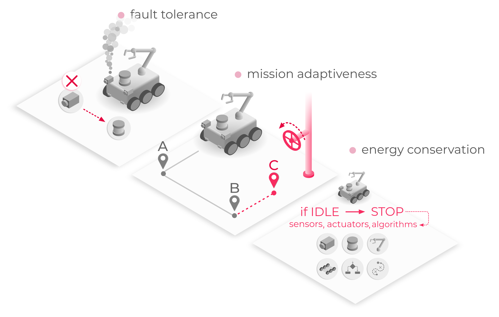
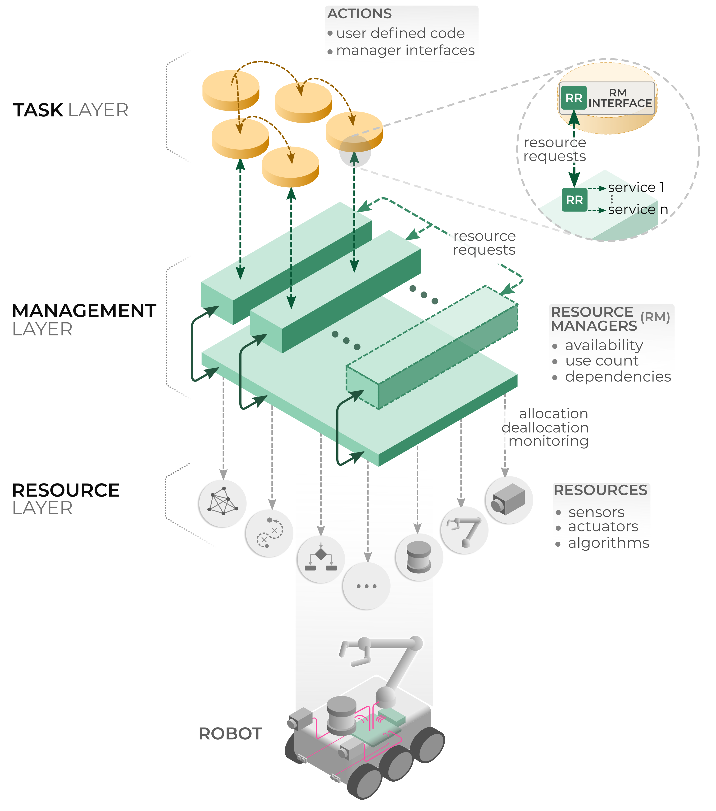
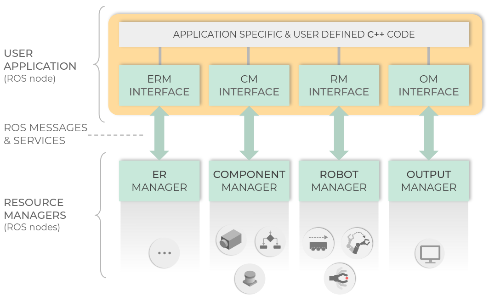

<p align="left">
  
</p>

This repository is an entry-point to TeMoto framework. 

[](https://opensource.org/licenses/Apache-2.0)

**More information about Temoto in https://temoto-telerobotics.github.io**

---

## Quick Overview

### What is TeMoto?
TeMoto is a ROS-based software framework for building dependable robotic applications for facilitating human-robot collaboration and autonomy.

TeMoto provides a set of software tools that help solving common challenges in applications covering system reliability, human-robot collaboration and multi-robot systems.

***And just like any other toolbox, it's up to the user of the toolbox to decide what tool is right for the application.***

### Key features of TeMoto

* **Dynamic resource management**: Existing components, or resources such as a camera, lidar, CPU intensive algorithm, etc.  can be programmatically monitored, started and stopped.
    
* **Task management**: TeMoto separates mission strategy related code from functional resources, such as sensors and actuators. A task consists of modular actions that implement a specific behaviour, e.g., a sensing or a navigation action. Actions can contain any arbitrary user defined code and can dynamically start, stop and access resources. 
    
* **Minimal development overhead**: TeMoto does not require any resource customization, i.e., existing ROS packages can be used via TeMoto without modification.
    
* **Full system modularity**: While TeMoto contains a number of subsystems (ROS nodes), each subsystem has minimal dependencies. This allows the robotics community to adopt only the tools that matter for their project and keeps code bloat at a minimum.

### Use-case Example
TeMoto framework allows dynamic use of a system's hardware and software resources enabling Long-Term Autonomy (LTA), redundancy and energy efficiency. For example, a planetary rover equipped with a number of sensors and actuators could be deployed in a remote site with a variety of mission(s) that last for long periods of time. Unexpected sensor failures have to be resolved by substituting the failed resource with similar or combined resources. Also, the goals of the mission can change, which requires a modular way to separate mission control logic from the resource management, thus maximizing code reuse and therefore development efficiency. 

As mentioned earlier, not every feature or tool of TeMoto is required for deployment. The developer can choose the tools that matter the most and discard the rest.
<p align="center">
  
</p>

## In-Depth Overview

### Core Concepts and the Architecture

The TeMoto framework stems from three distinct concepts:

* **Action** - A system developer defined and dynamically executable code module that can embed custom logic, such as mission execution strategy.
    
* **Resource** - Generically a *resource* is something allocated or deallocated upon a request, e.g., a camera. A *resource* is not limited to hardware devices, it could also describe an algorithm (image filter, object recognizer, etc) or a combination of *sub-resources*. Resource types are resources described by the same set of parameters.
    
* **Resource Manager** - A subsystem responsible for serving *resource* requests. Different resources types can be handled by the same *resource manager*.

***These concepts, when combined, form the architecture of a TeMoto-based software system. However, this architecture is purely conceptual is not enforced in implementation, thus keeping the use of individual tools within the layers flexible.*** 

<p align="center">
  
</p>

### TeMoto Resource Managers

* **External Resource Manager** (ERM) allows to dynamically invoke programs (hereinafter External Resources or ERs), including ROS executables, ROS launch files and regular executables. Each requested program is a resource that ERM is managing.
    
* **Component Manager** is designed to maintain information about components and pipes. Components are resources that encompass ROS based programs (nodes/launch files) which provide sensing or data processing functionalities. Pipes are resources that encompass information about data processing pipelines, composed of components. Components describe regular ROS nodes or launch files. The Component Manager maintains this information including published/subscribed topics, ROS package names, and invokes them via ERM.
    
* **Robot Manager** maintains information about robotic manipulators, grippers, and mobile bases and can dynamically provide access to all drivers comprising a single robot through a unified interface, i.e., Robot Manager Interface. A single device or an assembly of robotic devices compose a robot resource. It utilizes ROS MoveIt and ROS Navigation for manipulation- and navigation-related functionalities accordingly.
    
* **Output Manager** provides visualization for output data. Similar to the Component Manager, the Output Manager maintains descriptions about different types of output methods and how to access them. ROS RViz is used as the main platform for visualization. Each displayable data type that is supported by the Output Manager is displayed via dynamically loadable RViz plugins (regarded as a resource in the Output Manager).

<p align="center">
  
</p>

### TeMoto Actions

**Actions** are code modules that embed developer-defined task logic. 
* *Actions* accept and provide data, i.e., parameters, which makes an *action* reusable in different scenarios, e.g., a “navigation” *action *that accepts the destination coordinates as an input. 
* An *action* is not a program executed as a standalone process by the OS. It is a plug-in dynamically loaded by a host program, making both able to share system memory for quick data exchange. The Action Engine is a host program that provides dynamic loading and execution of *actions*. 
* Action Engine manages multiple *actions*, supporting sequential/concurrent execution and loops. Thus a range of tasks can be described and executed by combining primitive and reusable *actions*. For example, “picking up an object” task can be formed by “locate-object,” “navigate-to,” “move-manipulator-at,” and “grab” *actions* executed sequentially.

## Installation Instructions

``` bash
# Navigate to your catkin workspace
cd <catkin_workspace>/src

# Clone TeMoto and all it's dependencies
git clone --recursive https://github.com/temoto-telerobotics/temoto

# Build your workspace
catkin build
``` 

## Code Examples

Here are few examples of how different tools of TeMoto framework can be embedded into your application. 

### Using the External Resource Manager

This is a simple demonstration of ERM from client's perspective. ERM is used to load a ROS related program (rqt_graph) and also regular Ubuntu program (Gnome calcultator).  First, here's the whole C++ demo application (explanations will follow):

``` c++
#include "ros/ros.h"
#include "temoto_er_manager/temoto_er_manager_interface.h"

void resourceFailureCallback(temoto_er_manager::LoadExtResource load_resource_msg)
{
  ROS_WARN_STREAM("The following resource stopped unexpectedly\n" << load_resource_msg.request);
}

int main(int argc, char** argv)
{
  ros::init(argc, argv, "test_er_client_node");

  temoto_er_manager::ERManagerInterface ermi(true);
  ermi.registerUpdateCallback(resourceFailureCallback);

  ROS_INFO("Loading gnome-calculator");
  temoto_er_manager::LoadExtResource load_resource_msg = ermi.loadSysResource("gnome-calculator");
  ros::Duration(5).sleep();

  ROS_INFO("Unloading gnome-calculator");
  ermi.unloadResource(load_resource_msg);

  ROS_INFO("Loading rqt_graph");
  ermi.loadRosResource("rqt_graph", "rqt_graph");
  ros::Duration(5).sleep();
}
```

>
>``` c++
>temoto_er_manager::ERManagerInterface ermi(true);
>```
>Create External Resource Manager Interface object that provides a simplified API for communicating with the External Resource Manager. The boolean "true", that's passed to the constructor of ERM interface tells it whether it should be initialised immediately, or that's done later by the user.

<br/>

>``` c++
>ermi.registerUpdateCallback(resourceFailureCallback);
>```
>You can register a custom routine (not required) where resource failures are reported.

<br/>

>``` c++
>temoto_er_manager::LoadExtResource load_resource_msg = ermi.loadSysResource("gnome-calculator");
>
>ros::Duration(5).sleep();
>
>ermi.unloadResource(load_resource_msg);
>```
>Load the Gnome calculator as an example of a regular system program. Additional arguments can also be passed as a second `std::string` variable.
>
>ER Manager allows to invoke ROS executables, ROS launch files and other programs. The `loadRosResource` and `loadSysResource` methods return a `temoto_er_manager::LoadExtResource` object which contains the details regarding the query. This can be later used to unload the resource.

<br/>

>``` c++
>ermi.loadRosResource("rqt_graph", "rqt_graph");
>```
>Load a ROS program an example of a ROS executable (regularly invoked via `rosrun`). The first parameter indicates the ROS package name and the second indicates the executable. Additional arguments can also be passed as a third `std::string` variable. The same method can be used to load ROS launch files.
>
>Note that this time the `unloadResource` was not invoked, as the destructor of `ermi` object automatically unloads all loaded resources.

<br/>